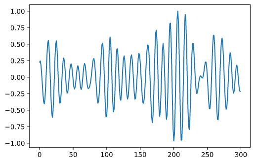
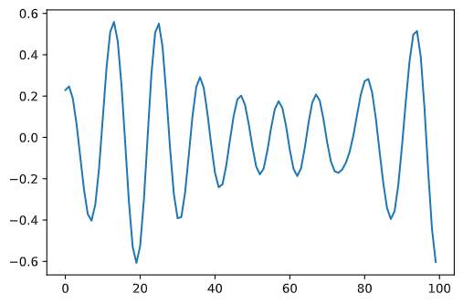
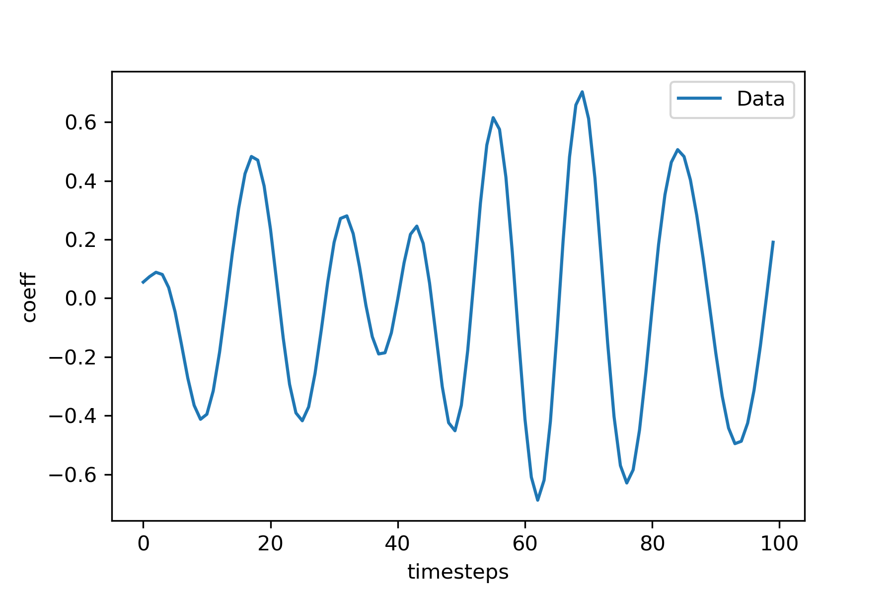
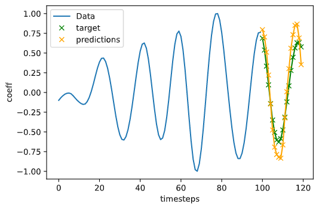
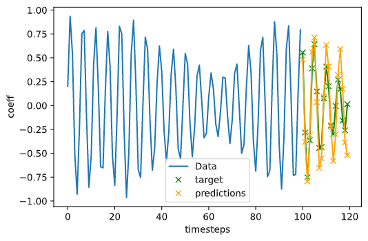
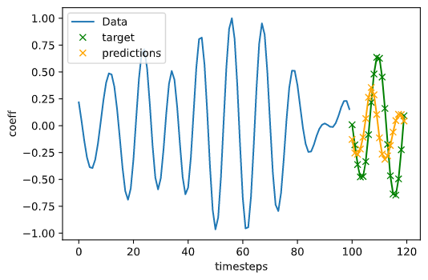
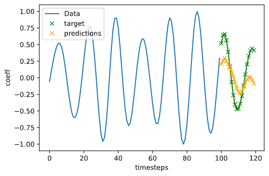
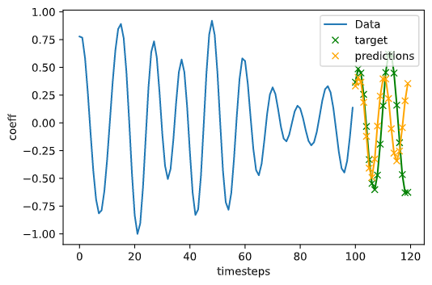

### LSTM for time series forecasting

---

On importe un ensemble de coefficients temporels dans un tableau de données *data*. Pour chaque mode il y a 300 observations $a_n(t)$. Dans un premier temps on va importer seulement 10 modes.

    data.shape = (Longueur des sequences, nombres de modes)
    ex:
        seqlen = 300
        nbr_modes = 10
        data.shape = (300, 10)

    plot du premier coefficient : plot(data[:, 0])

Puis on sépare le  training set et le validation set

    training set 70% : data_train.shape = (210, 10)
    validation set 30% : data_valid.shape = (90, 10)

Fenêtrage des données: on va diviser ces longues sequences de 210 points en fenetres superposées de longeur iw avec un stride de 30%. 

    ex:
    iw = 100
    stride = 30

Exemple d'une fenetre de taille *iw = 100*:

Pour chaque fenêtre (séquence de 100 observations d'un mode) on cherche à predire les *ow* pas de temps suivants. Ainsi pour chaque fenêtre on crée un ensemble de labels correspondants "y_train" (*en vert*).

    plot:
        iw = 100
        ow = 20

L'ensemble des inputs *x_train* et leur labels *y_train* ont pour dimensions:

    x_train.shape = (iw, nbr_fenetres, nbr_modes)
    y_train.shape = (ow, nbr_fenetres, nbr_modes)

    ex:
        x_train.shape = (100, 4, 10)
        y_train.shape = (20, 4, 10)

et un élément individuel du training set correspond à un *x* associé à son label $y$:
    
    x = x_train[:, i, :]
    y = y_train[:, i, :]

    x.shape = (100, 1, 10)
    y.shape = (20, 1, 10)

En général, les NN sont entrainés par batch de plusieurs éléments. Or on peut constater ici que la taille maximale de batch autorisée est très petite (4). Par exemple s'il on a un *bath_size = 2*, un batch d'entrainement aura pour dimension:
    
    x_batch.shape = (100, 2, 10)

On remarque que l'ensemble des modes (ici 10) sont insérés en même temps dans le LSTM. Ce qui devient problèmatique si l'on souhaite entrainer une centaines de modes vu les grandes différences en fréquence entre ces modes.

 ---
 
On peut éviter ce problème, en redimenssionant les données pour qu'un element *x* corresponde à un seul mode. 

    x_train.shape = (seqlen, nbr_fenetres*nbr_modes, 1)
    y_train.shape = (seqlen, nbr_fenetres*nbr_mode, 1)

    ex:
        x_train.shape = (100, 40, 1)
        y_train.shape = (20, 40, 1)

        x.shape = (100, 1, 1)
        y.shape = (20, 1, 1)

Cela permet aussi d'avoir des batch size plus grand (bs = 16, 32, 64, 128 plutot que 2 ou 4) mais surtout cela nous permet d'intégrer beaucoup plus de modes dans le dataset (200 voir 300 plutot que 10 par 10).

*Note: Vu que l'entrainement a lieu par batch certains modes seront quand même entrainés en même temps dans le LSTM.*

Les résultats sont alors bien meilleurs qu'avant malgré des défauts:

Mode 30

Mode 110

Défaut: Mode 49

Défaut: Mode 37

Mode 48

### Conclusion:
 Est ce des résultats satisfaisants ? Comment peut on le quantifier ? Peut on vraiment faire de  meilleures prédictions avec d'autres algorithmes ou sommes nous limités par la qualité des données ? Transfer learning pas mieux (incapacité de prédirer des sinusoides modulées), les transformers peuvent ils faire mieux (WIP) ?